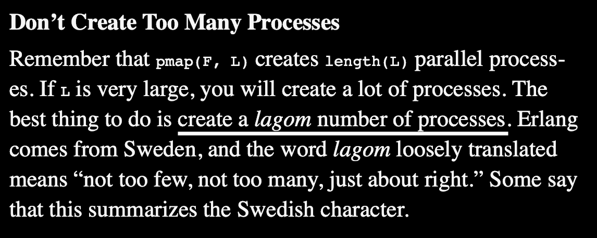
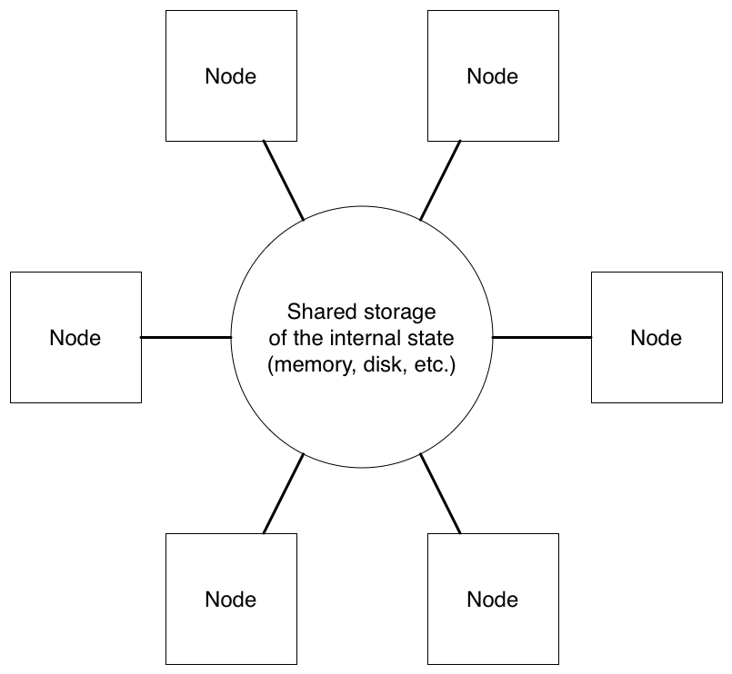
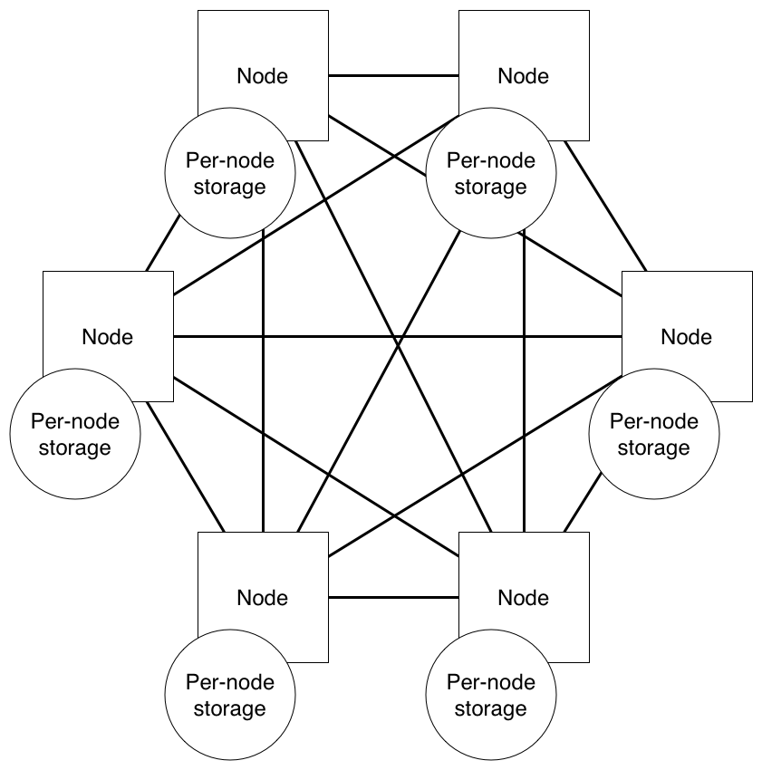
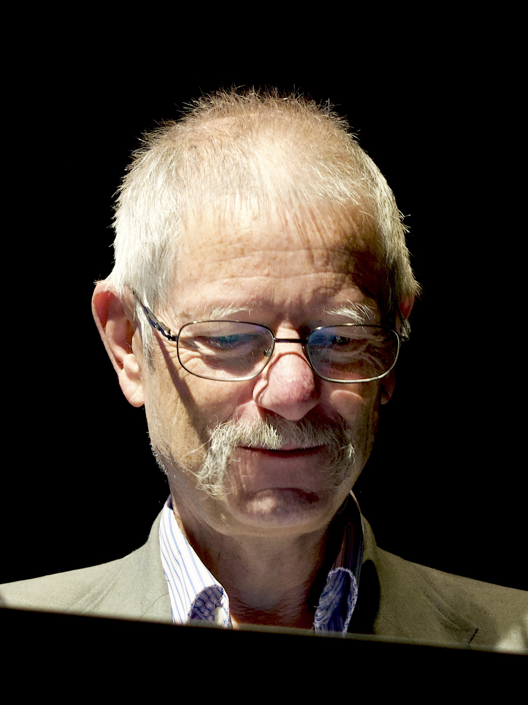

theme: Plain Jane, 2
footer: \#CodeBEAMSTO 2019 / Kenji Rikitake
slidenumbers: true

<!-- Use Deckset 2.0, aspect ratio 16:9 -->


# [fit] The BEAM Programming Paradigm [^*]

## ` `
## ` `
## ` `
## ` `
## ` `
## ` `
## Kenji Rikitake | @jj1bdx
## #CodeBEAMSTO 2019

[^*]: ... Or how I've been struggling to understand the well-designed ideas behind the Erlang/OTP, Elixir, and other BEAM languages and systems, while I still have a very hard time to learn "object-oriented" programming languages

---


Kenji Rikitake
17-MAY-2019
Code Beam STO 2019
Stockholm, Sweden
@jj1bdx

^ Good afternoon, my name is Kenji Rikitake. I'm an Erlang user since 2008. I'm a freelance software engineer and consultant, and a co-creator of Erlang rand module. I'm going to talk about the BEAM Programming Paradigm.

---

# Programming paradigm?
# What is that?
# Is it about a programming *paradise*?

^ When I first heard the phrase called "programming paradigm", I was perplexed. I didn't grasp the core meaning of the word "paradigm" at that time. All I knew then was there's no paradise on programming.

---

# Paradigm = pattern + worldview [^1]

* A typical example or pattern of something; a model
* A worldview underlying the theories and methodology of a particular scientific subject

[^1]: New Oxford American Dictionary, macOS 10.14.4

^ I later learned that the word paradigm was about a pattern, and a worldview represented by the underlying theories and methodology of a scientific subject.

---

# Programming paradigm, shown in Wikipedia

> Programming paradigms are a way to classify programming languages based on their features.
-- [Wikipedia](https://en.wikipedia.org/wiki/Programming_paradigm)

^ In Wikipedia, there is a definition of programming paradigms, quote: programming paradigms are a way to classify programming languages based on their features: unquote. So, simply speaking, the word paradigm means the features, for programming.

---

# Languages -> paradigms -> concepts

* Many languages belong to one paradigm
* A language may have many paradigms available
* A paradigm may have many concepts

## [fit] Peter Van Roy states there are 27 different programming paradigms [^2]

[^2]: Peter Van Roy: [Programming Paradigms for Dummies: What Every Programmer Should Know](https://www.info.ucl.ac.be/~pvr/paradigms.html), 2009, Section 2

^ Peter Van Roy, the first keynote speaker of this conference, has published a comprehensive reference for the programming paradigms, called Programming Paradigms for Dummies, publicly available on the web. In the document, he shows that many languages belongs to the same paradigm, and a paradigm may have many concepts. His document explains twenty-seven paradigms, and it indeed represents the complexity of the real world.

---

# Programming paradigm:
## Language patterns, worldview, and features
## Simplified characteristics of the features
## Design philosophy

^ Let me summarize a rather casual definition of the word "programming paradigm". It's about the language patterns, worldview, and the features. It also represents simplified characteristics of the features. And I'd like to define that it's a part of design philosophy of the language.

---

# Then what is the BEAM Programming Paradigm?

^ Then what really is the BEAM Programming Paradigm?

---


# The philosophy of the BEAM languages/systems:
# [fit] Lagom

^ My recognition of the philosophy of the BEAM languages and systems is *Lagom*.

---

# [fit] Lagom: not too much, not too little, just right

## Lagom är bäst

### Just the right amount is best / enough is as good as a feast [^3]

[^3]: [Wikitionary entry of "Lagom är bäst"](https://en.wiktionary.org/w/index.php?title=lagom_%C3%A4r_b%C3%A4st&oldid=44679439)


^ Lagom is a Swedish word explaning a state of not too much, not too little, and just right, amount, quantity, or a level of strength. There is a popular Swedish quote which says "Lagom är bäst", which means just the right amount is best.

---

# Lagom in philosophy

## 中庸 / Zhōngyōng, Chu-yaw
### Confucianism: Doctrine of the Mean
## μεσότης / mesotes
### Aristotle: Golden Mean

^ You can find a few philosophical concepts similar to lagom in the world. In China and Japan, the word Zhongyong or Chu-yaw, also called The doctrine of the Mean in English, is popular for not pursuing in the excessive ways. In the old Greek Ethics of Aristotle, it's called "mesotes", also called Golden Mean, which is about the desirable middle between two extremes of excess and deficiency.

---

# Quote from Programming Erlang [^4]




[^4]: Joe Armstrong, ["Programming Erlang", Second Edition, Pragmatic Bookshelf](https://pragprog.com/book/jaerlang2/programming-erlang), 2013, Section 26.3, "Parallelizing Sequential Code"

^ Joe Armstrong writes in his book of Programming Erlang that creating a lagom number of processes is essential, and that the word lagom summarizes the Swedish character. Joe is a British person, so I guess he found the usage of lagom intriguing.

---

# Computer is as greedy as people: anti-lagom

* People want *fast* actions: more speed in less time
* Speed-first programming: cutting corners, less secure
* People want more features (really?)
* Feature bloat: bloatware, software inefficiency
* Less stable, safe, and secure software

^ I've been working in computer industry for almost 30 years. The industry is thoroughly anti-lagom. I've found the steady tendency of greed among the industry vendors and users: they always demand faster software with more features. Developers have to cut corners and deliver less secure software, with inefficient code. I've heard that security and privacy are the last priorities for many startup companies, if not all. These are not good for the future of the industry.

---

# Lagom: accuracy transcends speed

* Safety transcends speed
* Simplicity transcends rich features
* Stability transcends convenience

... these targets are more easily actualized by thinking a bit about how lagom your software is

... and these are the phisolophy of *the BEAM programming paradigm*

^ The lagom philosophy of BEAM language systems looks against the trend of faster and fancier software. There's an old saying among telegraphy operators, which says "accuracy transcends speed". I'd like to extend this principle into the modern software: safety transcends speed, simplicity transcends rich features, stability transcends convenience. Thinking a bit about lagom, or the just right way of using programming resources, will get you closer to actualize these targets, and make your software a better one.

---

# Erlang's programming paradigms [^5]

* Functional programming
* Message-passing concurrent programming
* Multi-agent programming (Erlang processes)
* Some shared states (Process dictionaries, ETS, Mnesia)

[^5]: Peter Van Roy: [Programming Paradigms for Dummies: What Every Programmer Should Know](https://www.info.ucl.ac.be/~pvr/paradigms.html), 2009, Figure 2 (Taxonomy of programming paradigms) and Table 1 (Layered structure of a definitive programming language)

^ Let's get back to the topic of programming paradigms. Peter Van Roy states Erlang has four major paradigms: functional programming, message-passing concurrent programming, multi-agent programming with the Erlang processes, and also including some shared states such as the process dictionaries, ETS, and Mnesia. These paradiem elements are also equally adaptive to Elixir and other BEAM languages.

---

# A hidden BEAM programming paradigm and design: safety first, speed second [^6]

* Strong enforcement of immutability
* deep-copied variables, no references
* ... Programmers still can write dangerous code if needed

[^6]: Kenji Rikitake, [Erlang and Elixir Fest 2018 Keynote Presentation](https://speakerdeck.com/jj1bdx/erlang-and-elixir-fest-2018-keynote), 16-JUN-2018, Tokyo, Japan

^ On the other hand, BEAM programming languages have their own hidden paradigms, or design philosophy. I'd like to summarize them as "safety first, speed second" principle. I'd like to talk about three major points: strong and enforced immutability; deep-copied storage handling; and giving exceptions to these restrictions when the programmer has to take the risks.

---

# Immutability [^7]

* Once the value is stored, it cannot be changed
* No mutable variables on either Erlang or Elixir, *unless explicitly stated as an external function (e.g., ETS) or processes*
* Immutability makes debugging easier because all stored values of created objects during actions remain untouched

[^7]: José Valim, [Comparing Elixir and Erlang variables](http://blog.plataformatec.com.br/2016/01/comparing-elixir-and-erlang-variables/), Plataformatec blog, January 12, 2016

^ Erlang and Elixir both enforce strong immutability. All variables in both languages are immutable, which means once the values are stored they cannot be changed. All non-immutable, or mutable states, are explicitly defined as external functions including the process dictionary and the processes themselves. This enforcement of immutability makes debugging easier, because all stored values of the created objects are fully traceable.

---

# Variable binding strategies between Erlang and Elixir differs with each other

* Erlang: single binding only, with implicit pattern matching
* Elixir: multiple binding allowed as default, pattern matching enforceable with the pin (`^`) operator

^ There are difference on how to treat variable bindings between Erlang and Elixir. Erlang allows single binding only, and the equal sign implicitly means the pattern matching. On the other hand, Elixir allows multiple binding for the variables, which can be changed to allow the pattern matching only, by the pin operator.

---

# Erlang enforces single binding variables

```erlang
1> A = 10.
10
2> A = 20.
** exception error: no match of right hand side value 20
% Each variable can only be bound *once and only once*
3> B = [1, 2].
[1,2]
4> [_, X] = B, X.
2 % Bindings are equivalent to the pattern matching
```

^ This is a simple example of how Erlang variables differ from the other programming languages. In this example, the second binding of A is refused. This is because the binding is equivalent to the pattern matching.

---

# Advantages of Erlang's single-binding variables

* Debugging gets easier: once a variable is bound, it doesn't change until the function exits
* The meaning attached to every variable must be clearly defined, because no shared meaning is allowed

^ I believe Erlang's single-binding variables have two advantages. The first one is that they make debugging even more easier, because once a variable is bound, it doesn't change until the function exits. And the second one is that the meaning attached to every variable must be clearly defined, because you cannot reuse the variable by rebinding.

---

# Erlang's ambiguity on case expression (1)

```erlang
case an_expr() of
  % S is bound to an_expr()'s result
  {ok, S} -> do_when_matched();
  _ -> do_when_unmatched()
end
```

^ One thing you need to be aware of the handling of unbound variables in Erlang is that the pattern matching to the unbound variable means binding the variable to the value of the expression part of the case expression, in this example, the an_expr().

---

# Erlang's ambiguity on case expression (2)

```erlang
S = something, % newly added
case an_expr() of
  % an_expr()'s result is pattern-matched implicitly
  % to the result of previous S instead
  {ok, S} -> do_when_matched();
  _ -> do_when_unmatched()
end
```

^ If you add the binding of the variable in the pattern-matching clauses of the case expression *before* the case expression, the rebinding is not allowed, so the pattern-matching clause has become a real pattern matching, not the binding, in this case, the variable S in the tuple.

---

# Elixir allows variable rebinding [^8]

```elixir
iex(1)> a = 10
10
iex(2)> a = 20
20 # a is rebound
# pin operator forces pattern matching without rebinding
iex(3)> ^a = 40
** (MatchError) no match of right hand side value: 40
```

^ And this is a simple example of how Elixir handle the variables. Since Elixir allows rebinding, the second expression will rebind the variable "a" to value 20. When the rebinding operation should be prohibited, you can explicitly state it by adding a pin operator before the variable "a", as in the third expresion.

[^8]: [Stack Overflow: What is the “pin” operator for, and are Elixir variables mutable?](https://stackoverflow.com/a/27975233/417862)

---

# Advantages of Elixir's multiple binding

* Aligning well with the default behavior of many other languages
* Pattern-matching is explicitly controllable to remove ambiguity, e.g. for case expressions

^ Allowing the rebinding of variables in Elixir have two advantages. The first one is that it's easier for the programmers to understand, because many if not most of the programming languages allow reassignments to the variables. The second one if that the pin operator can be used to remove ambiguity of rebinding, for example, in case expressions.

---

# Elixir on case expression (1)

```elixir
s = :a_previous_value
case an_expr() do
  # s is bound to an_expr()'s result anyway
  {:ok, s} -> do_when_matched()
  _ -> do_when_unmatched()
end
```

^ This is an example in Elixir of the case expression, equivalent to the previous examples in Erlang. In this example, the variable "s" is rebound to the expression value of the function an_expr() of the case expression anyway, because of the allowance of rebinding.

---

# Elixir on case expression (2)

```elixir
s = :a_previous_value
case an_expr() do
  # an_expr()'s result is explicitly pattern-matched
  # with the content of s (:a_previous_value)
  # by the pin operator before s
  {:ok, ^s} -> do_when_matched()
  _ -> do_when_unmatched()
end
```

^ If you don't want the variable "s" to be rebound, you can explicitly prohibit the pin operator, as the caret before the "s", so that the result of the function an_expr() must be equal to the value `{:ok, :a_previous_value}` to execute and return the value of the function `do_when_matched().`

---

# Erlang's deep-copied variables

```erlang
1> A = 10, B = [A, 30].
[10,30]
2> f(A), A. % f(A): unbind A
* 1: variable 'A' is unbound
3> B.
[10,30] # old A remains in B
```

^ Let me talk about the deep-copied variables of Erlang. This is an example of how Erlang treats structured objects such as lists. In this example, a list B is created with one of the elements is A, and A becomes unbound by the Erlang shell pseudo-function f. Even this happens, the old A still remains there in B without affected by the unbinding of the old A.

---

# Elixir's deep-copied variables

```elixir
iex(1)> a = 10; b = [a, 30]
[10, 30]
iex(2)> a = 20; [a, b]
[20, [10, 30]] # old a remains in b
```

^ This is an equivalent example of the previous one shown in Erlang. the list "b" retains the previous integer value, 10, of the variable "a", when later bound as the second element of the list with the new value of the variable "a".

---

# Advantage of deep-copied variables

* Immutable, by always creating new object bodies for copying
* The same copy semantics is applied regardless of the data types, especially between simple (integers, atoms) and structured (lists, tuples, maps) types

^ I see deep-copied variables have two major advantages. The first one is that they are inherently immutable, because the copying action always create a new object body. And the second one is that the copy semantics is consistent regardless of the data types, especially between the simple ones such as integers and atoms, and the structured ones such as lists and tuples.

---

# Disadvantages of shared-nothing / deep-copied variables

* Slow: all assignments imply deep copying
* Much more memory space: *you cannot implicitly share*

... Are they really disadvantages at the age of abundant processing power and memory space?

^ I know deep copying of the variables has its own disadvantages. They are slow because you need to copy all data in a data structure. And you need much more memory space because you cannot implicitly share by pointing the same object by two or more different references. I'd like to disagree, however; are these disadvantages really that critical, at the age of abundant processing power and memory space? In BEAM, for example, these high-cost operations are highly optimized by copy-on-write mechanisms for larger binaries.

---

# Many of programming languages work in different ways *as default*

## [fit] Variables are not necessarily immutable
## [fit] Copy semantics differ between different data types

^ For the ten years since 2007 until 2017, I didn't write much code in anything but Erlang and Elixir. But after I worked on C# and C++ for approximately for a year until the end of May 2018, I realized that many of the programmers in the world were living in completely different programming paradigms. There are teo major differences: the first one is that variables are not necessarily immutable; and the second one is that copy semantics are complex and differ between different data types.

---

# LISP is not necessarily immutable, even it's a functional language [^9]

```lisp
(defparameter *some-list* (list 'one 'two 'three 'four))
(rplaca *some-list* 'uno)
(rplacd (last *some-list*) 'not-nil)
; result by CLISP 2.49
(ONE TWO THREE FOUR) ; original
(UNO TWO THREE FOUR) ; head replaced
(UNO TWO THREE FOUR . NOT-NIL) ; tail replaced
```

^ Even the very first functional programming language called LISP, is not necessarily immutable. rplaca and rplacd (ree-pla-kuh and ree-pla-kudee) are the two most popular functions to perform destructive operations to the head and tail part of a cons cell. In this Common Lisp example, the rplaca and rplacd changes the list cells in non-reversible manners.

[^9]: Source code example from [Hyperspec Web site](http://clhs.lisp.se/Body/f_rplaca.htm), modified by Kenji Rikitake, run on [Wandbox](https://wandbox.org/#) with [CLISP](https://clisp.sourceforge.io/) 2.49

---

# JavaScript has a complicated copy semantics

```javascript
// var a = {first: 1, second: 2}
// b = a // only sharing *references*
{ first: 1, second: 2 }
// a.second = 3
3
// b // changing a also changes b
{ first: 1, second: 3 }
// b == { first: 1, second: 3 }
false // WHY?
// The right-hand side is a *constructor*
```

^ This is my favorite example of how JavaScript handles the structured data as the objects. Copying an object only copies the reference. In this example the variables "a" and "b" points to the same object body, and if "a" is changed the "b" is also changed. And the interesting part is that the last line shows the variable "b" is *not equal* to the content of the same name-value pairs at the right-hand side of the equal comparison operator. Why? Because the right-hand side curly bracket data actually constructs a new object. This is so complex. And you need to deal with the constructor issues in C++ and C# as well.

---

# C# also has a complicated copy semantics

Type int is value copied, List is *reference* copied (why??)

```csharp
using System.Collections.Generic;
int i = 100; List<int> a = new List<int>(){10, 20};
MutableMethod(i, a);
void MutableMethod(int i, List<int> a) {
  i = 200; a.Add(30); }
```

Result: `i = 100, a = {10, 20, 30}`

^ C# has an interesting characteristics on handling structured data. When you pass a piece of data of simple type, or the value type as called in C#, to a function, it's immutable. When you pass a structured type, or the reference type as called in C#, to a function, it's not immutable; you can change the value of the list elements within the called function! This inconsistency of the copy semantics handling looks too complex to me.

---

# C++: can you tell the difference?

```C++
double func(std::vector<double> x);
double func(std::vector<double> &v); // with reference
double func(std::unique_ptr<std::vector<double>> u);
double func(std::shared_ptr<std::vector<double>> s);

std::vector<double> y = x;
std::vector<double> &w = v; // with reference
std::unique_ptr<std::vector<double>> u2 = std::move(u);
// You cannot -> std::unique_ptr<std::vector<double>> u3 = u;
```

... actually, I'm not sure I can accurately explain the difference.

^ And on C++. How many people here have written a piece of code in C++? Please raise your hand. How many people here can understand the four different types of the vector objects in this slide? Please raise your hand. If you can, you're a genius. I was perplexed when I saw the unique pointer which prohibited me to copy. And I didn't understand why the variable with and without using the reference, or the ampersand operator, to reduce the copying operation. I understand you need to supress the copying for a better speed, but this is too complex to understand. And if concurrency involves, there will be many non-deterministic issues happening; for example, you cannot really determine a shared pointer is no longer used or not.

---

# These languages perplex me by: [^10]

* Different actions for different data types
* Constructors (and destructors)
* Copy semantics (C#: value type, reference type)
* Shallow-copied objects = no immutability
* Shared state and references as default

^ Let me summarize how the modern languages perplex me. They act differently for copying different data types. The constructors and destructors. The copy semantics. And the objects are shallow-copied and shared by default, which is opposite to the default actions of the BEAM languages.

[^10]: Rikitake, K.: Shared Nothing Secure Programming in Erlang/OTP, IEICE Technical Report IA2014-11/ICSS2014-11, Vol. 114, No. 70, pp. 55--60 (2014). [(Slide PDF)](https://speakerdeck.com/jj1bdx/otp)

---

# Design of these languages

* Avoid object copying
* Creation of objects need explicit actions
* Explicit use of reference
* Object isolation is the programmer's responsibility

*... mostly for speed and cutting corners*

^ I understand that the design of these languages are mostly for speed, avoiding object copying, using less memory, and make the object isolation the programmer's responsibility. And I have to say they make the program unsafe.

---

# What BEAM languages provide

* Same actions for all data types
* No need for explicit constructors/destructors
* Single copy semantics (deep copy)
* Deep copied objects = immutability
* No shared state, no reference, as default

^ On the other hand, the BEAM languages works consistently on all data types, and has no need for explicitly constructing data because all copying means deep copying and inherently immutable. And there's no shared state or reference, as the default mode.

---

# Design of BEAM languages

* Deep-copying as default
* New objects are always created by assignments
* Prohibit use of reference
* Object isolation is the language's responsibility

*... for security first, and lagom speed second*

^ I understand that the design of the BEAM languages are not for speed but for making the object isolation without big hassles of the programmer. I think this is one of the reasons why the BEAM languages including Erlang and Elixir are safer and secure, while trying to provide lagom or just enough speed for safer computing.

---

# [fit] The BEAM Programming Paradigm difference
# [fit] from the popularly-used shared-state object-oriented languages:
# [fit] Choice of default data copying mode
# [fit] By choosing *lagom* speed traded in for much more secure programming

^ So let me summarize the BEAM Programming Paradigm: it's a distinct choice of default data copying mode and enforcing strong immutability as the default mode.

---
[.background-color: #666666]




^ There are two paradigms in the world: shared everything as the left half of the slide, or shared nothing as the right side of the slide.

---
[.background-color: #333333]


# Shared state .vs. distributed state:
# Which model is safer?
# Which model is more secure?
# Which model causes less bugs?

^ And let me ask a few questions: which model is safer, shared state of distributed state? Which model is more secure? And which model causes less bugs? The BEAM languages provide the shared-nothing distributed state as the default, for the safer, more secure, less buggy programming.

---

# Topics excluded from this talk

* BEAM architecture [^11]
* Concurrency models
* Process supervision and signals
* How BEAM languages handle shared states

^ I intentionally excluded the detailed architecture of BEAM, which is thoroughly explained by the Erik Stemman's The Beam Book, and the concurrency models, supervision, and how BEAM languages handle shared states. They are all far advanced topics.

[^11]: Erik Stemman, [The Beam Book](https://blog.stenmans.org/theBeamBook/)

---


# Acknowledgment

This presentation is suppored by
Pepabo R&D Institute, GMO Pepabo, Inc.

Thanks to Code BEAM Crew and Erlang Solutions!

... and thank you for being here!

^ I'd like to thank my sponsor Pepabo R&D Institute of GMO Pepabo for supporting this presentation, and to the Code BEAM Crew and Erlang Solutions as always. And thank you very much for being here!

---



# Thanks, Joe.

You taught me how to program in the principle of *lagom är bäst*.

You helped me finding out a new hope for programming, after I got lost in the C header files of ISC BIND 9.4.2 in 2007.

I'm impressed by your hospitality, as well as your creative mind.

We will remember you.

^ And I'd like to thank Joe Armstrong, the creator of Erlang, who taught me lagom är bäst for programming, and helped me to get out of the C code of ISC BIND 9 through his Programming Erlang 1st Edition book in 2008. I was very much impressed by his hospitality, as well as his creative mind. I'm sure we'll all remember him.

---


# [fit] Thank you
# [fit] Questions?

^ Thank you. Any questions?

---
[.autoscale: true]

# Photo / graphics credits

* [Title](https://unsplash.com/photos/peAbdH4O8GM): [Photo by Masayoshi Yamase on Unsplash](https://unsplash.com/@myana)

* [Lagom](https://unsplash.com/photos/_EiuAQtkyKo): [Photo by Jen P. on Unsplash](https://unsplash.com/@talesbyjen)

* Programming Erlang quote: from Pragmatic Bookshelf's EPUB ebook rendered by iBooks on macOS 10.14.4, underline added by Kenji Rikitake

* Joe Armstrong: [Photo by Brian L. Troutwine](https://www.dropbox.com/sh/18w4l9vbmgu98ov/AAAiTRknnIBbJAOEmn72INRfa?dl=0), edited by Kenji Rikitake, licensed [CC BY-NC 4.0 International](https://creativecommons.org/licenses/by-nc/4.0/)

* Pepabo R&D Institute Logo: GMO Pepabo, Inc.

* [Thank you page](https://unsplash.com/photos/3cwvFD-YPtk): [Photo by Raphael Andres on Unsplash](https://unsplash.com/@raphaeldas)

* All the other photos: Kenji Rikitake

<!--
Local Variables:
mode: markdown
coding: utf-8
End:
-->
