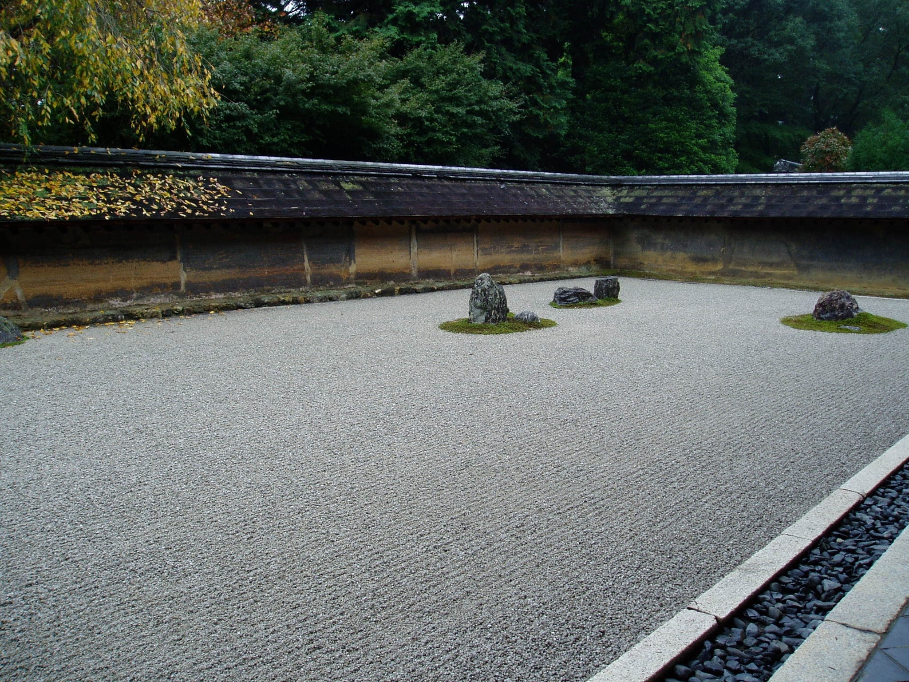

theme: Plain Jane, 2 
footer: \#CodeBEAMSTO 2019 / Kenji Rikitake
slidenumbers: true

<!-- Use Deckset 2.0, aspect ratio 16:9 -->

# [fit] The BEAM Programming Paradigm [^*]

## ` `
## ` `
## ` `
## ` `
## ` `
## ` `
## ` `
## ` `
## ` `
## ` `
## ` `
## ` `
## ` `
## ` `
## Kenji Rikitake | @jj1bdx
## #CodeBEAMSTO 2019

[^*]: ... Or how I've been struggling to understand the well-designed ideas behind the Erlang/OTP, Elixir, and other BEAM languages and systems, while I still have a very hard time to learn "object-oriented" programming languages

---

Kenji Rikitake
17-MAY-2019
Code Beam STO 2019
Stockholm, Sweden
@jj1bdx

^ Good afternoon, everybody. My name is Kenji Rikitake. I'm originally from Tokyo, Japan, and I'm going to talk about the BEAM Programming Paradigm.

---

# Programming paradigm?
# What is that?
# Is it about a programming *paradise*?

^ When I first heard the phrase called "programming paradigm", I was perplexed. I didn't grasp the core meaning of the word "paradigm" at that time. All I knew then was there's no paradise on programming.

---

# Paradigm = pattern + worldview [^1]

* A typical example or pattern of something; a model
* A worldview underlying the theories and methodology of a particular scientific subject

[^1]: New Oxford American Dictionary, macOS 10.14.4

^ I later learned that the word paradigm was about a pattern, and a worldview represented by the underlying theories and methodology of a scientific subject.

---

# Programming paradigm, shown in Wikipedia

> Programming paradigms are a way to classify programming languages based on their features.
-- [Wikipedia](https://en.wikipedia.org/wiki/Programming_paradigm)

^ In Wikipedia, there is a definition of programming paradigms, quote: programming paradigms are a way to classify programming languages based on their features. So, simply speaking, the word paradigm means the features, for programming.

---

# Languages -> paradigms -> concepts

* Many languages belong to one paradigm
* A languages may have many paradigms available
* A paradigm may have many concepts

## [fit] Peter Van Roy states there are 27 different programming paradigms [^2]

[^2]: Peter Van Roy: [Programming Paradigms for Dummies: What Every Programmer Should Know](https://www.info.ucl.ac.be/~pvr/paradigms.html), 2009, Section 2

^ Peter Van Roy, the first keynote speaker of this conference, has published a comprehensive reference for the programming paradigms, called Programming Paradigms for Dummies, publicly available on the web. In the document, he shows that many languages belongs to the same paradigm, and a paradigm may have many concepts. His document explains twenty-seven paradigms, and it indeed represents the complexity of the real world.

---

# Programming paradigm:
## Language patterns, worldview, and features
## Simplified characteristics of the features
## Design philosophy

^ Let me summarize a rather casual definition of the word "programming paradigm". It's about the language patterns, worldview, and the features. It also represents simplified characteristics of the features. And I'd like to define that it's a part of design philosophy of the language.

---

# Then what is the BEAM Programming Paradigm?

---

# The philosophy of the BEAM languages/systems:
# [fit] Lagom

^ I think the philosophy of the BEAM languages and systems is *Lagom*.

---

# [fit] Lagom: not too much, not too little, just right

## Lagom är bäst

### Just the right amount is best / enough is as good as a feast [^3]

[^3]: [Wikitionary entry of "Lagom är bäst"](https://en.wiktionary.org/w/index.php?title=lagom_%C3%A4r_b%C3%A4st&oldid=44679439)

^ Lagom is a Swedish word explaning a state of not too much, not too little, and just right, amount, quantity, or a level of strength. There is a popular Swedish quote which says "Lagom är bäst", which means just the right amount is best.

---

# Lagom in philosophy

## 中庸 / Zhōngyōng, Chu-yaw
### Confucianism: Doctrine of the Mean
## μεσότης / mesotes
### Aristotle: Golden Mean

^ You can find a few philosophical concepts similar to lagom in the world. In China and Japan, the word Zhongyong or Chu-yaw, also called The doctrine of the Mean in English, is popular for not pursuing in the excessive ways. In the old Greek Ethics of Aristotle, it's called "mesotes", also called Golden Mean, which is about the desirable middle between two extremes of excess and deficiency.

---

# Quote from Programming Erlang [^4]

[^4]: Joe Armstrong, ["Programming Erlang", Second Edition, Pragmatic Bookshelf](https://pragprog.com/book/jaerlang2/programming-erlang), 2013, Section 26.3, "Parallelizing Sequential Code"

^ Joe Armstrong writes in his book of Programming Erlang that creating a lagom number of processes is essential, and that the word lagom summarizes the Swedish character. Joe is a British person, so I guess he found the usage of lagom intriguing.

---

# Erlang's programming paradigms [^5]

* Functional programming
* Message-passing concurrent programming
* Multi-agent programming (Erlang processes)
* Some shared states (Process dictionaries, ETS, Mnesia)

[^5]: Peter Van Roy: [Programming Paradigms for Dummies: What Every Programmer Should Know](https://www.info.ucl.ac.be/~pvr/paradigms.html), 2009, Figure 2 (Taxonomy of programming paradigms) and Table 1 (Layered structure of a definitive programming language)

^ Let's get back to the topic of programming paradigms. Peter Van Roy states Erlang has four major paradigms: functional programming, message-passing concurrent programming, multi-agent programming with the Erlang processes, and also including some shared states such as the process dictionaries, ETS, and Mnesia. These paradirm elements are also equally adaptive to Elixir and other BEAM languages.

---

# Hidden BEAM programming paradigms [^6]

* Safety first, speed second
* Strong enforcement of immutability
* Shared-nothing and deep-copy storage handling (no reference)

[^6]: Kenji Rikitake, [Erlang and Elixir Fest 2018 Keynote Presentation](https://speakerdeck.com/jj1bdx/erlang-and-elixir-fest-2018-keynote), 16-JUN-2018, Tokyo, Japan

---

# Acknowledgment

This presentation is suppored by
Pepabo R&D Institute, GMO Pepabo, Inc.

Thanks to Code BEAM Crew and Erlang Solutions!

... and thank you for being here!

^ I'd like to thank my sponsor Pepabo R&D Institute of GMO Pepabo for supporting this presentation, and to the Code BEAM Crew and Erlang Solutions as always. And thank you very much for being here!

---

# Thanks, Joe.

You taught me how to program in the principle of *lagom är bäst*.

You helped me finding out a new hope for programming, after I got lost in the C header files of ISC BIND 9.4.2 in 2007.

I'm impressed by your hospitality, as well as your creative mind.

We will remember you.

^ And I'd like to thank Joe Armstrong, the creator of Erlang, who taught me lagom är bäst for programming, and helped me to get out of the C code of ISC BIND 9 through his Programming Erlang 1st Edition book in 2008. I was very much impressed by his hospitality, as well as his creative mind. I'm sure we'll all remember him.

---

# [fit] Thank you
# [fit] Questions?

^ Any questions?

---
[.autoscale: true]

# Photo / graphics credits

* Title: [Photo by Masayoshi Yamase on Unsplash](https://unsplash.com/@myana)

* Lagom: [Photo by Jen P. on Unsplash](https://unsplash.com/@talesbyjen)

* Programming Erlang quote: from Pragmatic Bookshelf's EPUB ebook, underline added by Kenji Rikitake

* Joe Armstrong: [Photo by Brian L. Troutwine](https://www.dropbox.com/sh/18w4l9vbmgu98ov/AAAiTRknnIBbJAOEmn72INRfa?dl=0), edited by Kenji Rikitake, licensed [CC BY-NC 4.0 International](https://creativecommons.org/licenses/by-nc/4.0/)

* Pepabo R&D Institute Logo: GMO Pepabo, Inc.

* All the other photos: Kenji Rikitake

<!--
Local Variables:
mode: markdown
coding: utf-8
End:
-->
